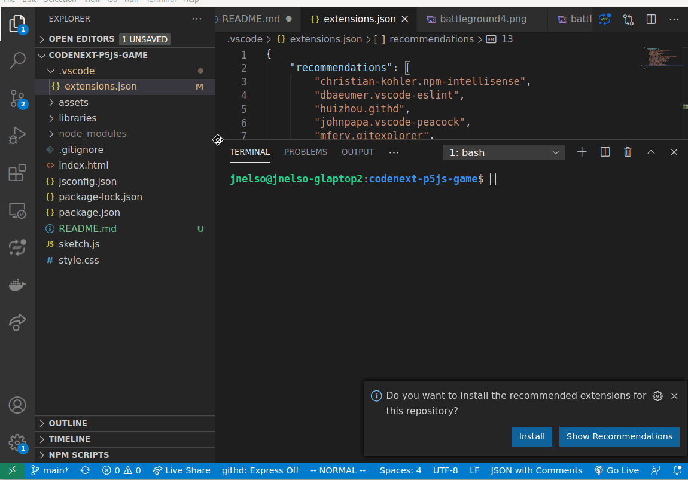

# Code Next p5.js Game Club

This project contains code used to create a game using p5.js. There are some
introductory topics you should read through before the first class. You'll
also need to get your laptop/computer setup to work with this project.

## Getting Started: Student Guide

You need to setup you laptop and download the project before getting started.
Follow these steps to get setup:

1. Install your software (**BEFORE** class)
    * [Install Visual Studio Code](https://code.visualstudio.com/download)
    * [Install Git](https://sourceforge.net/projects/git-osx-installer/files/latest/download)
    * [Install NodeJs](https://nodejs.org/en/download/)
2. Download the project to your computer        
   1. From a terminal on your computer type the following command: 
    ```shell
    git clone https://github.com/j0n3lson/codenext-p5js-game.git 
    ```
   2. Open VS Code and open the folder: `File > Open Folder` and browse to the 
      folder containing the code. Install all recommended extensions:

     
     

If you are an instructor or TA wanting to make changes to the repo, follow the
[Developer Guide](docs/developer_guide.md).