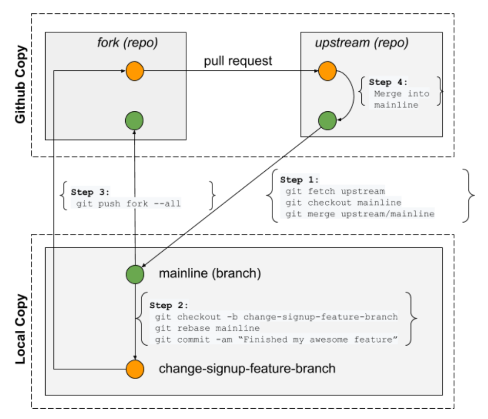

# Developer Guide

This page documents how to develop for this project. If you're an instructor
or TA, this doc is for you. If you are a student, follow the 
[Getting Started: Student Guide](../README.md).

For Instructors and TAs, complete all steps in the *Getting Started: Student
Guide*. Review the  following concepts.

## Prerequisites

If you're new to development you should review a few topics before getting
getting started. Make sure you understand these concepts before you get
started.

- 30m: You need to learn how to share code on GitHub. This excellent YouTube
    [video](https://youtu.be/GgjIvUrOpmg) shows you how.

## Development Workflow

We don't allow pushing to the `main` branch directly so you'll need to make
you changes in a feature branch.

1. Create a new branch
2. Code some stuff
3. Push your branch
4. Create a pull request

Here is a useful reference along with commands for each step in the workflow:

